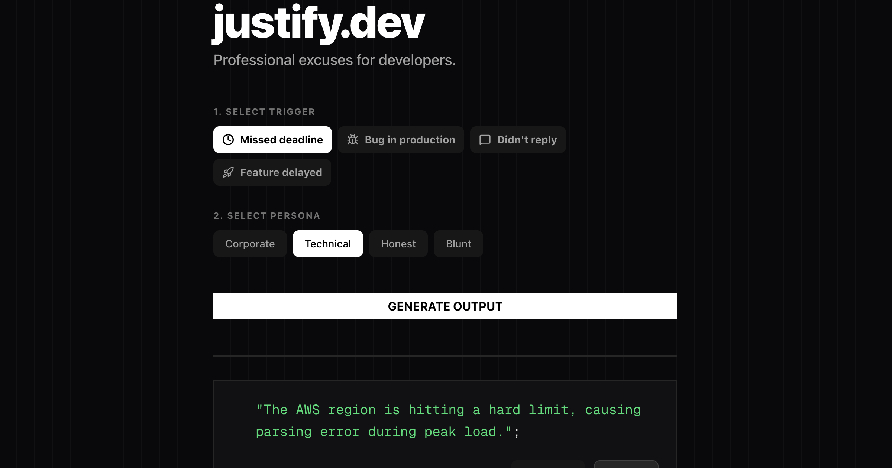

# justify.dev 🎲

> Professional excuses for developers. Built for fun, powered by chaos.

A playful web app that generates believable (and hilarious) excuses for common developer situations like missed deadlines, production bugs, delayed replies, and postponed features.



## 🎨 How It Works

The app uses a **Human-Readable ID (HRID)** style algorithm to generate excuses dynamically:

1. **Word Banks**: Curated lists of adjectives, nouns, verbs, corporate jargon, and technical terms
2. **Template System**: Category and tone-specific templates with placeholders
3. **Random Combination**: Fills templates with random words from appropriate banks
4. **Unique Output**: Creates thousands of possible excuse combinations

## 🛠️ Customization

### Adding New Excuses

Edit `lib/data/excuse-parts.ts` to add more words to the banks:

```typescript
export const adjectives = [
  'critical', 'legacy', 'distributed',
  // Add your words here
];
```

### Adding New Templates

Edit `lib/utils/excuse-generator.ts` to add new excuse templates:

```typescript
corporate: [
  `We're ${random(verbs)} ${random(adjectives)} ${random(nouns)}...`,
  // Add your template here
],
```

## 🎯 Use Cases

- **Standup meetings** when you're behind schedule
- **Slack messages** to your PM
- **Email replies** for delayed work
- **Creative writing practice** for corporate speak
- **Entertainment** (the primary use case)

## ⚠️ Disclaimer

This is a satirical tool built for entertainment purposes. While the excuses are professionally worded, we recommend:

- Using them sparingly (if at all)
- Being honest with your team
- Actually fixing the bugs
- Meeting your deadlines when possible

**Built for fun. Not responsible for consequences.** 😈

## 🤝 Contributing

Contributions are welcome! Please feel free to submit a Pull Request.

1. Fork the repository
2. Create your feature branch (`git checkout -b feature/AmazingFeature`)
3. Commit your changes (`git commit -m 'Add some AmazingFeature'`)
4. Push to the branch (`git push origin feature/AmazingFeature`)
5. Open a Pull Request
